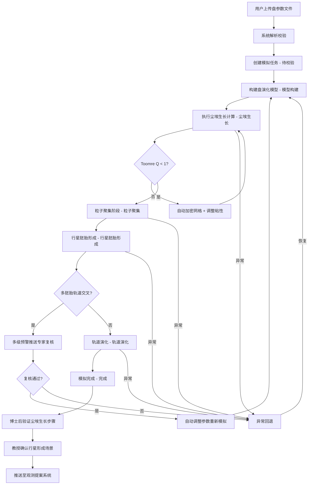

## 1. 产品概述

高精度原行星盘尘埃生长与行星形成模拟平台，面向天体物理学研究者，提供从盘参数上传、模型构建、尘埃生长模拟到行星形成全流程的自动化计算与监控能力。系统支持引力不稳定性自适应网格加密、多级行星胚胎轨道交叉预警、两级专家审批流程、智能参数推荐及综合报告生成，显著提升行星形成理论研究的效率与可重复性。

- **目标用户**：行星形成理论方向的博士后、教授及首席科学家
- **核心价值**：将复杂的原行星盘演化计算流程标准化、自动化，降低重复劳动，提升研究质量

## 2. 核心功能

### 2.1 用户角色

| 角色 | 注册方式 | 核心权限 |
|------|----------|----------|
| 博士后研究员 | 邀请注册 | 创建模拟任务、验证尘埃生长步骤、查看报告 |
| 教授 | 邀请注册 | 确认行星形成场景合理性、审批通过推送至观测提案系统 |
| 首席科学家 | 邀请注册 | 接收偏差预警通知、暂停/恢复参数组任务、查看综合看板 |

### 2.2 功能模块

1. **模拟控制台**：参数上传、任务创建、状态流转监控、实时指标面板
2. **尘埃演化可视化**：尘气比演化图、尘埃密度分布、粒径分布动态
3. **行星形成追踪**：胚胎质量-半长轴分布、轨道共振结构、行星系统构型
4. **审批管理中心**：两级审批流程、复核记录、调整日志
5. **数据导出中心**：按盘参数/时间窗口导出场数据与轨道元素
6. **智能推荐引擎**：基于历史结果推荐最优尘埃生长机制与盘粘性剖面
7. **综合看板**：每日统计模拟完成率、平均行星形成效率、收敛次数、性能趋势图与对比箱图

### 2.3 页面详情

| 页面名称 | 模块名称 | 功能描述 |
|----------|----------|----------|
| 模拟控制台 | 参数上传区 | 上传盘初始质量、粘性参数、尘埃粒径分布文件，自动解析校验 |
| 模拟控制台 | 任务创建面板 | 选择1D/2D模型、配置模拟参数、提交创建模拟任务 |
| 模拟控制台 | 状态流转图 | 展示8状态流转：待校验→模型构建→尘埃生长→粒子聚集→行星胚胎形成→轨道演化→完成/异常回退 |
| 模拟控制台 | 实时监控面板 | 实时显示尘埃生长速率曲线、局部Toomre Q参数分布、网格加密事件 |
| 模拟控制台 | 引力不稳定性告警 | 当Q<1时高亮告警，显示自适应网格加密与粘性系数调整详情 |
| 模拟控制台 | 轨道交叉预警 | 多胚胎轨道交叉时触发多级预警，推送至专家复核 |
| 尘埃演化可视化 | 尘气比演化图 | 时空演化热力图，展示尘气比随半径与时间变化 |
| 尘埃演化可视化 | 尘埃密度分布 | 1D径向/2D面密度分布图，支持动画播放 |
| 尘埃演化可视化 | 粒径分布动态 | 不同半径处粒径分布随时间的演化曲线 |
| 行星形成追踪 | 胚胎质量-半长轴图 | 散点图展示胚胎在质量-半长轴空间的位置 |
| 行星形成追踪 | 轨道共振结构 | 标注共振比（如2:1, 3:2）的轨道关系图 |
| 行星形成追踪 | 最终行星系统构型 | 展示模拟最终形成的行星系统俯视图 |
| 审批管理中心 | 审批队列 | 博士后验证尘埃生长步骤，教授确认行星形成场景 |
| 审批管理中心 | 调整日志 | 记录自动调整的初始盘参数或尘埃粘滞系数及原因 |
| 审批管理中心 | 参数偏差监控 | 连续三次行星数量偏差>30%时自动暂停并通知首席科学家 |
| 数据导出中心 | 条件筛选导出 | 按盘参数范围、时间窗口筛选，导出尘埃密度与轨道元素CSV/HDF5 |
| 数据导出中心 | 综合报告PDF | 生成含尘气比演化、胚胎分布、共振结构、系统构型的PDF报告 |
| 智能推荐引擎 | 机制推荐 | 基于历史模拟结果推荐最优尘埃生长机制（如碰撞黏附、引力不稳定性等） |
| 智能推荐引擎 | 粘性剖面推荐 | 推荐最优盘粘性剖面函数及参数范围 |
| 综合看板 | 每日统计 | 模拟完成率、平均行星形成效率、收敛次数 |
| 综合看板 | 趋势与对比 | 性能趋势折线图、对比箱图 |

## 3. 核心流程

用户上传盘参数文件 → 系统解析校验 → 创建模拟任务（状态：待校验）→ 自动构建1D/2D盘演化模型（状态：模型构建）→ 初始化气体与尘埃组分 → 执行尘埃生长计算（状态：尘埃生长）→ 实时监控生长速率与Toomre Q → Q<1时自动加密网格调整粘性 → 粒子聚集阶段（状态：粒子聚集）→ 行星胚胎形成（状态：行星胚胎形成）→ 检测多胚胎轨道交叉 → 触发预警推送专家复核 → 轨道演化（状态：轨道演化）→ 模拟完成（状态：完成）→ 博士后验证尘埃生长步骤 → 教授确认行星形成场景 → 推送至观测提案系统。若任一阶段异常则回退至上一稳定状态（异常回退），复核通过后自动调整参数重新模拟。连续三次偏差超30%自动暂停参数组。

## 4. 用户界面设计

### 4.1 设计风格

- **主色调**：深空黑（#0A0E1A）+ 星云紫（#7C3AED）+ 等离子橙（#F97316）
- **辅助色**：暗蓝灰（#1E293B）、极光绿（#10B981）、警告红（#EF4444）
- **按钮风格**：微圆角（6px），渐变填充，悬停发光效果
- **字体**：标题使用 Orbitron（科幻感），正文使用 Noto Sans SC
- **布局风格**：左侧固定导航 + 主内容区卡片化布局
- **图标风格**：线性图标（Lucide），辅以微光动效
- **背景**：深色星空粒子动效背景，营造宇宙科学氛围

### 4.2 页面设计概览

| 页面名称 | 模块名称 | UI元素 |
|----------|----------|--------|
| 模拟控制台 | 参数上传区 | 拖拽上传卡片，文件格式校验提示，解析进度条 |
| 模拟控制台 | 任务创建面板 | 表单输入框+下拉选择，1D/2D切换按钮，提交按钮带脉冲动效 |
| 模拟控制台 | 状态流转图 | 横向8节点流程图，当前节点高亮脉冲，已完成节点勾选，异常节点红色闪烁 |
| 模拟控制台 | 实时监控面板 | 双轴折线图（生长速率+Toomre Q），Q=1阈值虚线，告警区域红色填充 |
| 模拟控制台 | 引力不稳定性告警 | 浮动告警卡片，网格加密热力图小窗，粘性系数变化迷你图 |
| 模拟控制台 | 轨道交叉预警 | 预警等级徽章（橙/红），轨道俯视迷你图标注交叉点 |
| 尘埃演化可视化 | 尘气比演化图 | 时空热力图（半径×时间），色标从蓝到红，鼠标悬停显示数值 |
| 尘埃演化可视化 | 尘埃密度分布 | 极坐标/直角坐标切换，动画播放控件，帧进度条 |
| 尘埃演化可视化 | 粒径分布动态 | 多半径分组折线图，时间滑块联动 |
| 行星形成追踪 | 胚胎质量-半长轴图 | 对数坐标散点图，颜色编码胚胎质量，尺寸编码形成时间 |
| 行星形成追踪 | 轨道共振结构 | 同心圆轨道图+共振比标注，脉冲连线动效 |
| 行星形成追踪 | 最终行星系统构型 | 俯视图恒星居中，行星按比例大小与颜色渲染 |
| 审批管理中心 | 审批队列 | 卡片列表，状态标签，操作按钮，审批弹窗 |
| 审批管理中心 | 调整日志 | 时间轴布局，参数变更对比高亮 |
| 审批管理中心 | 参数偏差监控 | 偏差百分比仪表盘，暂停状态标识 |
| 数据导出中心 | 条件筛选导出 | 多条件筛选表单，导出格式选择，批量操作栏 |
| 数据导出中心 | 综合报告PDF | 报告预览卡片，一键生成按钮，下载链接 |
| 智能推荐引擎 | 机制推荐 | 推荐卡片+置信度条，历史对比迷你图 |
| 智能推荐引擎 | 粘性剖面推荐 | 剖面曲线对比图，参数范围滑块 |
| 综合看板 | 每日统计 | 三指标大数字卡片，环形进度图 |
| 综合看板 | 趋势与对比 | 多日趋势折线图，效率分布箱图 |

### 4.3 响应式设计

- 桌面优先设计，主内容区最小宽度1200px
- 大屏（≥1440px）：侧边导航展开 + 双栏内容
- 中屏（1200-1440px）：侧边导航折叠 + 单栏内容
- 移动端：底部导航 + 堆叠卡片

### 4.4 3D场景指引

- 行星系统构型可使用3D视角：暗色星空环境HDRI，微弱环境光+恒星点光源
- 摄像机：斜上方45度俯视，支持轨道控制旋转缩放
- 行星使用标准球体+程序化纹理，轨道线半透明发光
- 交互：点击行星高亮并显示详情卡片
