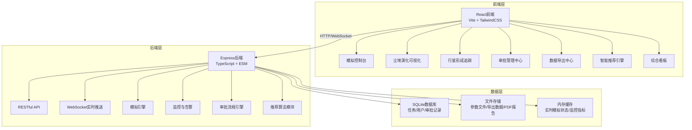
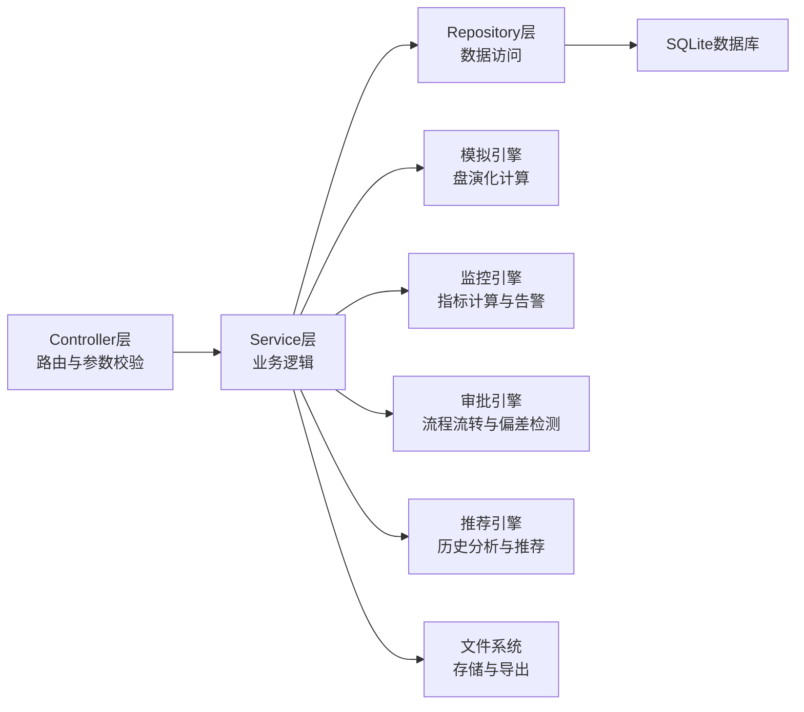
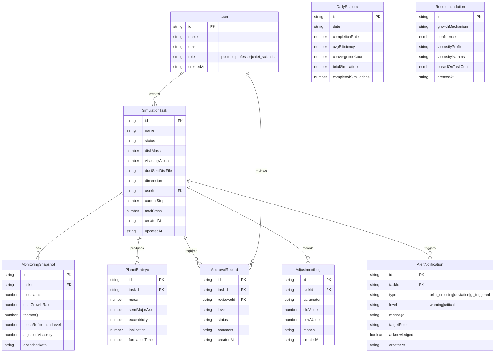

## 1. 架构设计



## 2. 技术说明

- **前端**：React@18 + TailwindCSS@3 + Vite
- **初始化工具**：vite-init（react-express-ts模板）
- **后端**：Express@4 + TypeScript（ESM格式）
- **数据库**：SQLite（better-sqlite3），任务持久化、用户管理、审批记录、调整日志
- **实时通信**：WebSocket（ws库），推送模拟状态、监控指标、告警通知
- **图表库**：Recharts（折线图/散点图/箱图）+ D3.js（热力图/极坐标图）
- **PDF生成**：后端使用pdfkit，前端预览使用react-pdf
- **状态管理**：Zustand
- **路由**：react-router-dom

## 3. 路由定义

| 路由 | 用途 |
|------|------|
| / | 首页/模拟控制台 |
| /simulation/:id | 模拟任务详情（含实时监控） |
| /dust-evolution | 尘埃演化可视化 |
| /planet-tracking | 行星形成追踪 |
| /approval | 审批管理中心 |
| /export | 数据导出中心 |
| /recommendation | 智能推荐引擎 |
| /dashboard | 综合看板 |

## 4. API定义

```typescript
interface SimulationTask {
  id: string
  name: string
  status: "pending_validation" | "model_building" | "dust_growth" | "particle_aggregation" | "embryo_formation" | "orbital_evolution" | "completed" | "error_rollback"
  diskMass: number
  viscosityAlpha: number
  dustSizeDistFile: string
  dimension: "1D" | "2D"
  createdAt: string
  updatedAt: string
  currentStep: number
  totalSteps: number
  toomreQValues: number[]
  dustGrowthRate: number[]
  embryos: PlanetEmbryo[]
  adjustmentLogs: AdjustmentLog[]
}

interface PlanetEmbryo {
  id: string
  mass: number
  semiMajorAxis: number
  eccentricity: number
  inclination: number
  formationTime: number
}

interface AdjustmentLog {
  id: string
  taskId: string
  parameter: string
  oldValue: number
  newValue: number
  reason: string
  createdAt: string
}

interface ApprovalRecord {
  id: string
  taskId: string
  level: "postdoc" | "professor"
  reviewerId: string
  status: "pending" | "approved" | "rejected"
  comment: string
  createdAt: string
}

interface DailyStatistics {
  date: string
  completionRate: number
  avgPlanetFormationEfficiency: number
  convergenceCount: number
  totalSimulations: number
  completedSimulations: number
}

interface Recommendation {
  id: string
  growthMechanism: string
  confidence: number
  viscosityProfile: string
  viscosityParams: Record<string, number>
  basedOnTaskCount: number
}

// POST /api/simulations - 创建模拟任务
// GET /api/simulations - 获取模拟任务列表
// GET /api/simulations/:id - 获取模拟任务详情
// POST /api/simulations/:id/start - 启动模拟
// POST /api/simulations/:id/pause - 暂停模拟
// POST /api/simulations/:id/rollback - 异常回退
// GET /api/simulations/:id/monitor - 获取实时监控数据

// POST /api/upload - 上传参数文件
// GET /api/export - 导出场数据与轨道元素
// POST /api/reports/:id/generate - 生成综合报告PDF
// GET /api/reports/:id/download - 下载PDF报告

// GET /api/approvals - 获取审批队列
// POST /api/approvals/:id/review - 提交审批意见
// GET /api/approvals/:id/logs - 获取调整日志

// GET /api/recommendations - 获取智能推荐
// GET /api/dashboard/daily - 获取每日统计
// GET /api/dashboard/trends - 获取趋势数据
// GET /api/dashboard/boxplot - 获取箱图数据

// WebSocket /ws - 实时模拟状态、监控指标、告警推送
```

## 5. 服务端架构图



## 6. 数据模型

### 6.1 数据模型定义



### 6.2 数据定义语言

```sql
CREATE TABLE users (
    id TEXT PRIMARY KEY,
    name TEXT NOT NULL,
    email TEXT UNIQUE NOT NULL,
    role TEXT CHECK(role IN ('postdoc', 'professor', 'chief_scientist')) NOT NULL,
    created_at TEXT DEFAULT (datetime('now'))
);

CREATE TABLE simulation_tasks (
    id TEXT PRIMARY KEY,
    name TEXT NOT NULL,
    status TEXT CHECK(status IN ('pending_validation', 'model_building', 'dust_growth', 'particle_aggregation', 'embryo_formation', 'orbital_evolution', 'completed', 'error_rollback')) DEFAULT 'pending_validation',
    disk_mass REAL NOT NULL,
    viscosity_alpha REAL NOT NULL,
    dust_size_dist_file TEXT,
    dimension TEXT CHECK(dimension IN ('1D', '2D')) DEFAULT '1D',
    user_id TEXT REFERENCES users(id),
    current_step INTEGER DEFAULT 0,
    total_steps INTEGER DEFAULT 1000,
    created_at TEXT DEFAULT (datetime('now')),
    updated_at TEXT DEFAULT (datetime('now'))
);

CREATE TABLE monitoring_snapshots (
    id TEXT PRIMARY KEY,
    task_id TEXT REFERENCES simulation_tasks(id) ON DELETE CASCADE,
    timestamp REAL NOT NULL,
    dust_growth_rate REAL,
    toomre_q REAL,
    mesh_refinement_level INTEGER DEFAULT 0,
    adjusted_viscosity REAL,
    snapshot_data TEXT,
    created_at TEXT DEFAULT (datetime('now'))
);

CREATE TABLE planet_embryos (
    id TEXT PRIMARY KEY,
    task_id TEXT REFERENCES simulation_tasks(id) ON DELETE CASCADE,
    mass REAL NOT NULL,
    semi_major_axis REAL NOT NULL,
    eccentricity REAL DEFAULT 0,
    inclination REAL DEFAULT 0,
    formation_time REAL NOT NULL
);

CREATE TABLE approval_records (
    id TEXT PRIMARY KEY,
    task_id TEXT REFERENCES simulation_tasks(id) ON DELETE CASCADE,
    reviewer_id TEXT REFERENCES users(id),
    level TEXT CHECK(level IN ('postdoc', 'professor')) NOT NULL,
    status TEXT CHECK(status IN ('pending', 'approved', 'rejected')) DEFAULT 'pending',
    comment TEXT,
    created_at TEXT DEFAULT (datetime('now'))
);

CREATE TABLE adjustment_logs (
    id TEXT PRIMARY KEY,
    task_id TEXT REFERENCES simulation_tasks(id) ON DELETE CASCADE,
    parameter TEXT NOT NULL,
    old_value REAL NOT NULL,
    new_value REAL NOT NULL,
    reason TEXT NOT NULL,
    created_at TEXT DEFAULT (datetime('now'))
);

CREATE TABLE daily_statistics (
    id TEXT PRIMARY KEY,
    date TEXT UNIQUE NOT NULL,
    completion_rate REAL NOT NULL,
    avg_efficiency REAL NOT NULL,
    convergence_count INTEGER NOT NULL,
    total_simulations INTEGER NOT NULL,
    completed_simulations INTEGER NOT NULL
);

CREATE TABLE recommendations (
    id TEXT PRIMARY KEY,
    growth_mechanism TEXT NOT NULL,
    confidence REAL NOT NULL,
    viscosity_profile TEXT NOT NULL,
    viscosity_params TEXT NOT NULL,
    based_on_task_count INTEGER NOT NULL,
    created_at TEXT DEFAULT (datetime('now'))
);

CREATE TABLE alert_notifications (
    id TEXT PRIMARY KEY,
    task_id TEXT REFERENCES simulation_tasks(id) ON DELETE CASCADE,
    type TEXT CHECK(type IN ('orbit_crossing', 'deviation', 'gi_triggered')) NOT NULL,
    level TEXT CHECK(level IN ('warning', 'critical')) NOT NULL,
    message TEXT NOT NULL,
    target_role TEXT NOT NULL,
    acknowledged INTEGER DEFAULT 0,
    created_at TEXT DEFAULT (datetime('now'))
);

CREATE INDEX idx_tasks_status ON simulation_tasks(status);
CREATE INDEX idx_tasks_user ON simulation_tasks(user_id);
CREATE INDEX idx_snapshots_task ON monitoring_snapshots(task_id);
CREATE INDEX idx_embryos_task ON planet_embryos(task_id);
CREATE INDEX idx_approvals_task ON approval_records(task_id);
CREATE INDEX idx_approvals_status ON approval_records(status);
CREATE INDEX idx_alerts_task ON alert_notifications(task_id);
CREATE INDEX idx_alerts_acknowledged ON alert_notifications(acknowledged);
CREATE INDEX idx_stats_date ON daily_statistics(date);
```
